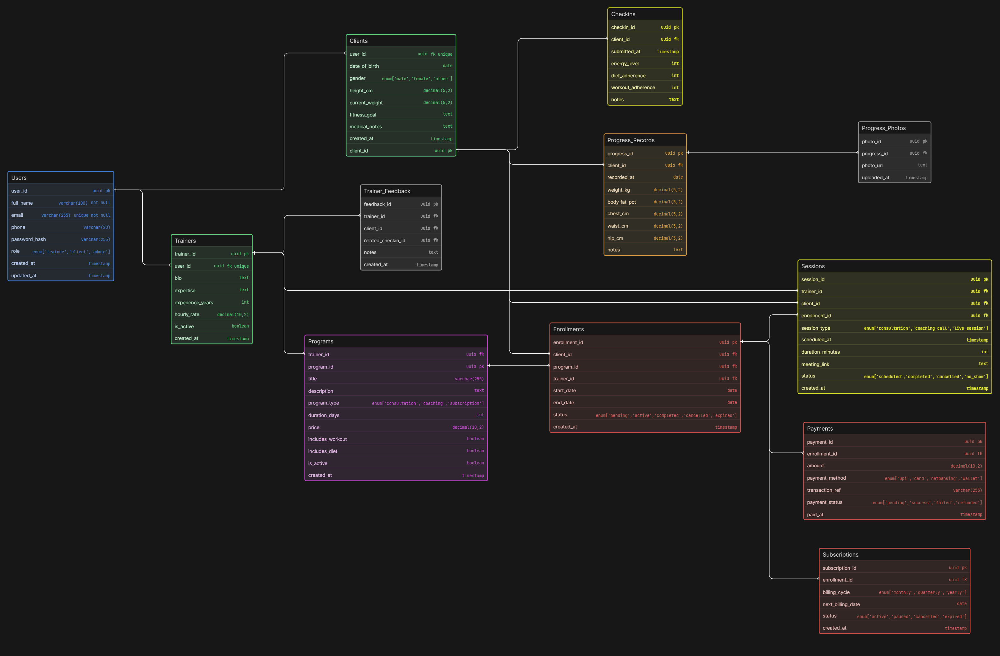

# Fitness Coaching Platform - ER Diagram

## 🚀 Project Overview

This project represents a database design for an online fitness coaching platform where trainers manage clients, sell programs, schedule sessions, and track progress.

---

## 🧠 Business Understanding

This is not a gym system — it models a real-world **online coaching ecosystem**:

* Trainers coach multiple clients
* Clients can purchase multiple programs over time
* Some users only take consultations
* Some enroll in long-term coaching plans
* Progress is tracked separately using check-ins and metrics

---

## 🏗️ Core Entities

* Users (base entity)
* Trainers & Clients
* Programs (plans)
* Enrollments
* Subscriptions
* Payments
* Sessions (consultations/live calls)
* Check-ins (weekly reports)
* Progress tracking (body metrics + photos)
* Trainer feedback

---

## 🔗 Key Relationships

* One trainer → many programs
* One client → many enrollments
* One program → many clients
* One enrollment → payments + sessions + subscription
* Sessions and check-ins are handled separately
* Progress tracking is independent of user data

---

## 💡 Key Design Decisions

* **Enrollments vs Subscriptions separated** → supports both one-time & recurring plans
* **Sessions ≠ Check-ins** → real-world coaching behavior
* **Progress stored separately** → scalable and clean design
* **Trainer feedback modeled independently**

---

## 🎨 ER Diagram

  

---

## 🛠️ Tech Used

* ER Diagram Tool: Draw.io / Eraser / Excalidraw
* Version Control: GitHub

---

## 📂 Files Included

* ER Diagram Image (PNG)
* ER Diagram Code (Text format)

---

## 👨‍💻 Author

Rochak Tiwari
